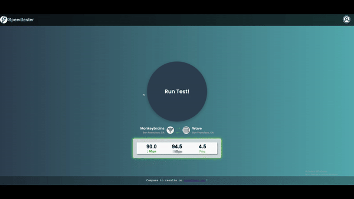

# SpeedTester


## Overview
[SpeedTester](https://giovanni-rojas.github.io/SpeedTester/) is a React-based frontend interface for the [@cloudflare/speedtest](https://www.npmjs.com/package/@cloudflare/speedtest) library, designed to measure a user's internet connection speed.

## How It Works
SpeedTester provides accurate, real-time network speed results by leveraging the Cloudflare Speedtest library to measure your latency, upload, and download speeds. In addition to speed testing, the app displays info about the client's host server and a test server closest to the user.

### Key Features
- **Powered by @cloudflare/speedtest**: Core functionality of speed testing is handled by this library, ensuring fast and accurate results.
- **Client and Test Server Information**: Uses [ipify](https://www.ipify.org/) and the [speedtest.net](https://www.speedtest.net/) server API to identify the user's closest testing server.
- **Progress Visualization**: Animations display real-time updates of test progress as it runs.

## Compare Results
Compare your results with industry-standard tests like Ookla's [speedtest.net](https://www.speedtest.net/) to get a broader view of your connection speeds.

## How to Run the Project

To run this project locally, you will need Node.js installed.

1. Clone the repository:
   ```bash
   git clone https://github.com/your-username/SpeedTester.git
   cd SpeedTester
   ```
2. Install dependencies:
    ```bash
    npm install
    ```
3. Start development server:
    ```bash
    npm start
    ```
4. Build for production:
    ```bash
    npm run build
    ```

### Backend Requirements
This project only handles the frontend for running speed tests. For the app to function properly, it needs to connect to a suitable backend server to manage the full data flow for speed testing, test server selection, and other network details.

## Contributing
Contributions are welcome! Here's how you can contribute:

1. **Fork the repository**: Click the "Fork" button on the top right of the GitHub page to create your own copy.
2. **Clone the forked repository** to your local machine:
   ```bash
   git clone https://github.com/your-username/SpeedTester.git
    ```
3. **Create a new branch** for your feature or bug fix:
    ```bash
    git checkout -b feature-name
    ```
4. **Make your changes** and commit them:
    ```bash
    git commit -m "Add feature name or fix description"
    ```
5. **Push your changes** to your fork:
    ```bash
    git push origin feature-name
    ```
6. **Create a pull request:** Once your changes are pushed, go to the original repository and create a pull request to merge your changes into the main project.

Please open an issue or start a discussion before submitting large changes. Contributions that improve the app or address existing issues are greatly appreciated.

## History
- **Version 1.0.0**: Initial release. This version includes basic network speed testing functionality using the @cloudflare/speedtest library, as well as features to display the user's client and closest test server.

## Credits
- Speed testing powered by [@cloudflare/speedtest](https://www.npmjs.com/package/@cloudflare/speedtest).
- Client and test server information provided by the [ipify](https://www.ipify.org) and [speedtest.net](https://www.speedtest.net) server API.
- User interface and frontend implementation by [Giovanni Rojas](https://giovanni-rojas.github.io/).

## License
SpeedTester is released under the [MIT License](https://opensource.org/license/MIT).
